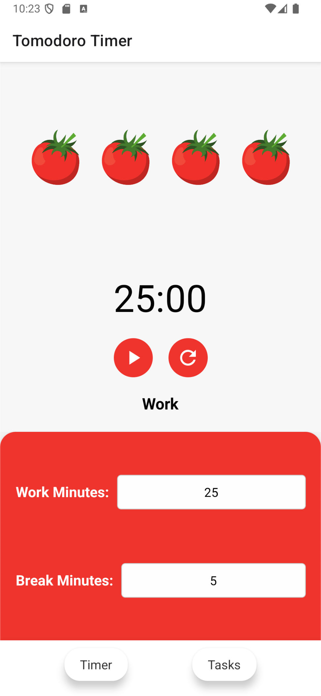
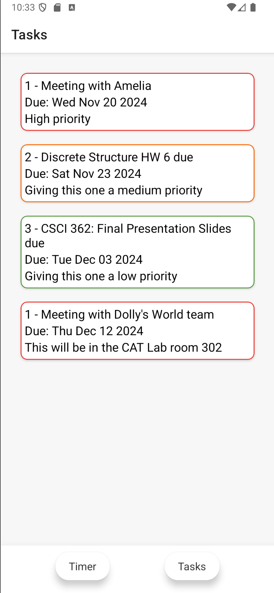
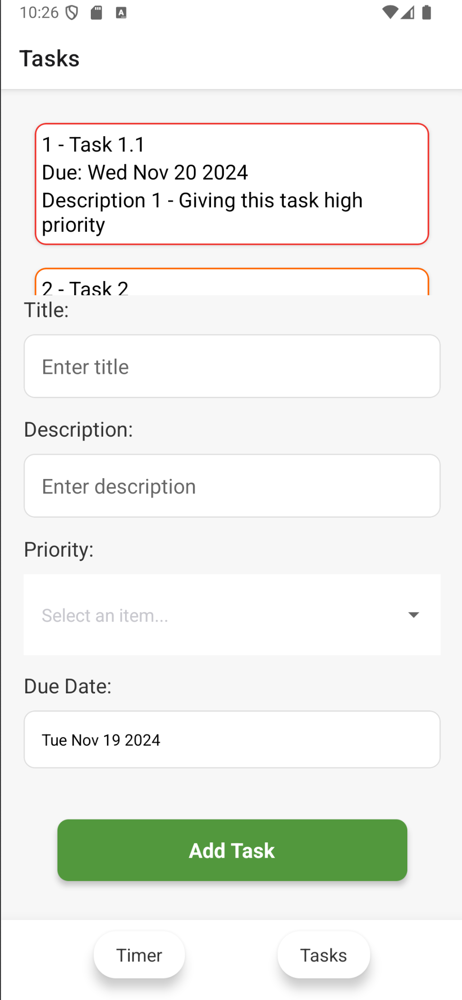
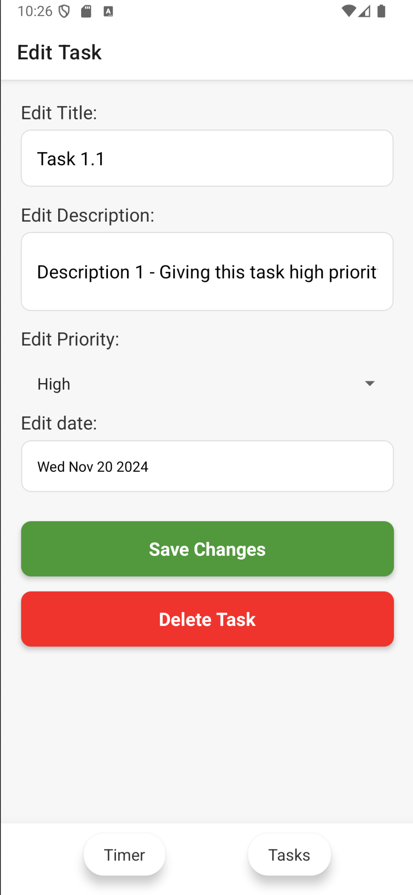

# Tomodoro Timer

A tomato-themed Pomodoro timer and task management app built with React Native. Combine focused work sessions with efficient task management, all wrapped in a tomato theme.

## Getting Started
Follow these instructions to build and run the project

1. Install React Native development environment:
    - Follow the [React Native CLI Setup Guide](https://reactnative.dev/docs/environment-setup)
    - **This project is using Expo**

2. Clone and set up the project:
```bash
git clone https://github.com/jfelic/PomodoroAndTasklistApp.git
cd ActualProject
npm install
```

3. Start the app:
```bash
npx expo start
```

4. Open with:
    - Expo Go app on your phone (scan QR code)
    - iOS simulator
    - Android emulator

## Features

### Pomodoro Timer
- Customizable work and break session lengths
- Visual tomato theme with disappearing tomatoes for completed sessions
- Clean, intuitive timer interface

### Task Management
- Create, edit, and delete tasks
- Task properties include:
  - Title
  - Description
  - Priority levels (visually indicated by colored borders)
    - High Priority: Red border
    - Medium Priority: Orange border
    - Low Priority: Green border
  - Due date selection
- Full task list view with priority-based visual organization

## Screenshots
<table>
  <tr>
    <td></td>
    <td></td>
  </tr>
  <tr>
    <td></td>
    <td></td>
  </tr>
</table>


## Technologies Used
- React Native
- Expo
- Navigation
  - @react-navigation/native
  - @react-navigation/native-stack
- Storage & Data
  - @react-native-async-storage/async-storage 
- UI Components
  - @react-native-community/datetimepicker
  - @react-native-picker/picker
  - react-native-picker-select
  - react-native-vector-icons